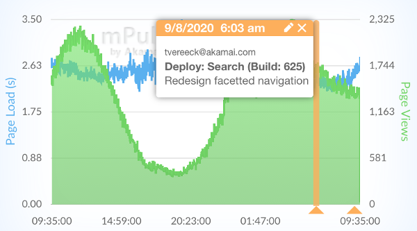

<p align="center">
  
  <h3 align="center">GitHub Action to submit annotations to Akamai mPulse</h3>
  <p align="center">
    
  </p>
</p>

# Annotate Akamai mPulse  

This action calls the Akamai Api's to submit <a href="https://developer.akamai.com/akamai-mpulse-real-user-monitoring-solution" target="_blank">mPulse</a> annotations to the Akamai platform. 
<p align="center">
    
</p>

## Usage

All sensitive variables should be [set as encrypted secrets](https://help.github.com/en/articles/virtual-environments-for-github-actions#creating-and-using-secrets-encrypted-variables) in the action's configuration.

## Authentication

You need to declare a `AKAMAI_mPulseApiToken` secret in your repository.

<a href="https://learn.akamai.com/en-us/webhelp/cloudtest/cloudtest/GUID-2778BD58-45C9-4DAD-9440-822A6471AF68.html" target="_blank">Follow this guide to retrieve your apiToken.</a>

## Inputs

### `Auth-Token`
**Required**
API Token: used to authenticate against the Akamai platform

### `title`
**Required**
Title: Currently set to use the following format: 'Repository name - Build build number'

### `time`
**Required** 
current time in UTC milliseconds

### `text`
**Required** 
Text: Currently set to use git commit message

### `tennant`
**Required** 
Tennant: The tennant you wish to assign the annotation to

### `domainIds`
**Optional** 
List of domain id's: use a comma to seperate. i.e 123,123. Leave blank if not specifying

## `workflow.yml` Example

Place in a `.yml` file such as this one in your `.github/workflows` folder. [Refer to the documentation on workflow YAML syntax here.](https://help.github.com/en/articles/workflow-syntax-for-github-actions)

```yaml
steps:
      - name: Annotation - start of deployment
        uses: jdmevo123/akamai-mpulse-annotation-action@1.0
        with:
          Auth-Token: ${{ secrets.AKAMAI_MPULSEAPITOKEN }} 
          title: ${{ github.event.repository.name }} - Build:${{ github.run_number }}
          text: ${{ github.event.head_commit.message }}
          tennant: "" #If api key has access to multiple tennant place the tennant name here, otherwise leave as blank. 
```
If you wish to submit domain id's, use the following YAML:
```yaml
steps:
      - name: Annotation - start of deployment
        uses: jdmevo123/akamai-mpulse-annotation-action@1.0
        with:
          Auth-Token: ${{ secrets.AKAMAI_MPULSEAPITOKEN }} 
          title: ${{ github.event.repository.name }} - Build:${{ github.run_number }}
          text: ${{ github.event.head_commit.message }}
          tennant: "" #If api key has access to multiple tennant place the tennant name here, otherwise leave as blank. 
          domainIds: "123,124" #Optional  #Domain ID's split by comma. i.e. "123,124"
```

## License

This project is distributed under the [MIT license](LICENSE.md).
